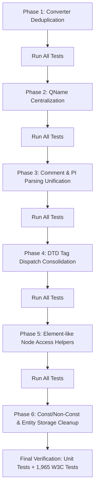

# XML_Lib Concrete DRY Refactoring Plan

## 1. Executive Summary

This document presents a comprehensive, actionable refactoring plan to eliminate code duplication across the `XML_Lib` codebase and achieve complete **DRY (Don't Repeat Yourself)** compliance.

An exhaustive audit of `classes/include/` and `classes/source/` identified 6 primary duplication and boilerplate patterns spanning parser engines, DTD validators, XPath evaluators, XSD helpers, platform converters, and node accessors.

Refactoring will be executed in modular, independently verifiable phases. At every stage, the test suite (108 unit test cases with 1,620 assertions and all 1,965 official W3C XML Conformance tests) must maintain a **100% pass rate with zero regressions**.

---

## 2. Identified Duplications & Concrete Refactoring Targets

### Area 1: Cross-Platform UTF Converter Deduplication

#### Problem
- `classes/source/implementation/converter/linux/XML_Converter.cpp` (56 lines) and `classes/source/implementation/converter/macos/XML_Converter.cpp` (63 lines) are **100% verbatim duplicate implementations** using `<codecvt>` and `std::codecvt_utf8_utf16<char16_t>`.
- The single-character overload `std::string toUtf8(const char16_t utf16) { return toUtf8(std::u16string(1, utf16)); }` is also duplicated verbatim across `linux`, `macos`, and `windows` converter implementations.
- `CMakeLists.txt` redundantly branches on `APPLE` vs `LINUX` solely to pick between these identical files.

#### Solution
1. Consolidate `linux/XML_Converter.cpp` and `macos/XML_Converter.cpp` into a single platform-standard implementation:
   `classes/source/implementation/converter/posix/XML_Converter.cpp` (or `standard/XML_Converter.cpp`).
2. Remove `classes/source/implementation/converter/linux/` and `classes/source/implementation/converter/macos/`.
3. Update `CMakeLists.txt` to select `posix` when not building on Windows (`MSVC`).
4. Inline the trivial single-character overload `toUtf8(const char16_t utf16)` into `classes/include/XML_Converter.hpp` (or common converter base), removing it from platform `.cpp` files.

#### Affected Files
- `[NEW]` [classes/source/implementation/converter/posix/XML_Converter.cpp](file:///home/robt/projects/XML_Lib/classes/source/implementation/converter/posix/XML_Converter.cpp)
- `[DELETE]` [classes/source/implementation/converter/linux/XML_Converter.cpp](file:///home/robt/projects/XML_Lib/classes/source/implementation/converter/linux/XML_Converter.cpp)
- `[DELETE]` [classes/source/implementation/converter/macos/XML_Converter.cpp](file:///home/robt/projects/XML_Lib/classes/source/implementation/converter/macos/XML_Converter.cpp)
- `[MODIFY]` [classes/source/implementation/converter/windows/XML_Converter.cpp](file:///home/robt/projects/XML_Lib/classes/source/implementation/converter/windows/XML_Converter.cpp)
- `[MODIFY]` [classes/include/XML_Converter.hpp](file:///home/robt/projects/XML_Lib/classes/include/XML_Converter.hpp)
- `[MODIFY]` [CMakeLists.txt](file:///home/robt/projects/XML_Lib/CMakeLists.txt)

---

### Area 2: QName / Namespace Splitting & Validation Centralization

#### Problem
The logic to find a colon `pos = name.find(':')`, extract `prefix`, extract `localName`, and validate single-colon QName constraints is implemented independently in 6 different subsystems:
1. `classes/include/implementation/node/XML_Element.hpp:70-80`:
   - `Element::prefix()`: `name().find(':')` -> `name().substr(0, colon)`
   - `Element::localName()`: `name().find(':')` -> `name().substr(colon + 1)`
2. `classes/source/implementation/xsd/XSD_NodeHelpers.cpp:13`:
   - `localTagView(node)`: `name.find(':')` -> `view.substr(pos + 1)`
3. `classes/source/implementation/xsd/XSD_Validator_Impl_Validate.cpp:412`:
   - `typeName.find(':')` -> `typeName.substr(colon + 1)`
4. `classes/source/implementation/xpath/XPath_EvalHelpers.cpp:67`:
   - `nodeLocalNameView(node)`: `nm.find(':')` -> `nm.substr(pos + 1)`
5. `classes/source/implementation/xpath/XPath_Evaluator.cpp:583`:
   - XPath `local-name()` function: `nodeName.find(':')` -> `nodeName.substr(pos + 1)`
6. `classes/source/implementation/xml/parser/Default_Parser.cpp:386-390, 448-453`:
   - Duplicated QName colon validation for elements: `if (pos == 0 || pos + 1 >= elemName.size() || elemName.find(':', pos + 1) != std::string::npos)`
   - Duplicated QName colon validation for attributes: `if (pos == 0 || pos + 1 >= attrName.size() || attrName.find(':', pos + 1) != std::string::npos)`

#### Solution
1. Introduce a unified QName view and helper suite in `classes/include/implementation/common/XML_QName.hpp` (or `XML_ParseHelpers.hpp`):
   ```cpp
   struct QNameView {
     std::string_view prefix;
     std::string_view localName;
     [[nodiscard]] bool hasPrefix() const noexcept { return !prefix.empty(); }
   };

   [[nodiscard]] constexpr QNameView splitQName(std::string_view qname) noexcept;
   [[nodiscard]] constexpr std::string_view getLocalName(std::string_view qname) noexcept;
   [[nodiscard]] constexpr std::string_view getPrefix(std::string_view qname) noexcept;
   [[nodiscard]] bool isValidQName(std::string_view qname) noexcept;
   void validateQName(std::string_view qname, std::string_view contextName, const ISource &source);
   ```
2. Replace all ad-hoc splitting and validation across `XML_Element.hpp`, `XSD_NodeHelpers.cpp`, `XSD_Validator_Impl_Validate.cpp`, `XPath_EvalHelpers.cpp`, `XPath_Evaluator.cpp`, and `Default_Parser.cpp` with these centralized primitives.

#### Affected Files
- `[NEW]` [classes/include/implementation/common/XML_QName.hpp](file:///home/robt/projects/XML_Lib/classes/include/implementation/common/XML_QName.hpp)
- `[NEW]` [classes/source/implementation/common/XML_QName.cpp](file:///home/robt/projects/XML_Lib/classes/source/implementation/common/XML_QName.cpp)
- `[MODIFY]` [classes/include/implementation/node/XML_Element.hpp](file:///home/robt/projects/XML_Lib/classes/include/implementation/node/XML_Element.hpp)
- `[MODIFY]` [classes/source/implementation/xsd/XSD_NodeHelpers.cpp](file:///home/robt/projects/XML_Lib/classes/source/implementation/xsd/XSD_NodeHelpers.cpp)
- `[MODIFY]` [classes/source/implementation/xsd/XSD_Validator_Impl_Validate.cpp](file:///home/robt/projects/XML_Lib/classes/source/implementation/xsd/XSD_Validator_Impl_Validate.cpp)
- `[MODIFY]` [classes/source/implementation/xpath/XPath_EvalHelpers.cpp](file:///home/robt/projects/XML_Lib/classes/source/implementation/xpath/XPath_EvalHelpers.cpp)
- `[MODIFY]` [classes/source/implementation/xpath/XPath_Evaluator.cpp](file:///home/robt/projects/XML_Lib/classes/source/implementation/xpath/XPath_Evaluator.cpp)
- `[MODIFY]` [classes/source/implementation/xml/parser/Default_Parser.cpp](file:///home/robt/projects/XML_Lib/classes/source/implementation/xml/parser/Default_Parser.cpp)
- `[MODIFY]` [CMakeLists.txt](file:///home/robt/projects/XML_Lib/CMakeLists.txt)

---

### Area 3: Comment, PI, and String Lowercase Unification

#### Problem
1. **Comment Parsing Loop**:
   - `Default_Parser::parseComment` (`Default_Parser.cpp:163-172`) and `DTD_Impl::parseComment` (`DTD_Validator_Impl_Parse.cpp:378-383` and `DTD_Validator_Impl_Parse_External.cpp:160-161`) duplicate the identical character scan loop:
     `while (source.more() && !match(source, "--")) { if (!validChar(...)) throw ...; ... }` followed by closing `>` check.
2. **Processing Instruction (PI) Parsing**:
   - `Default_Parser::parsePI` (`Default_Parser.cpp:184-217`) and `DTD_Impl::parsePI` (`DTD_Validator_Impl_Parse.cpp:391-409`) duplicate:
     - Reading target name via `parseName(source)`.
     - Lowercasing the name to check for disallowed "xml" PI targets.
     - Verifying whitespace after target when parameters exist.
     - Scanning parameter body while validating `validChar` until `?>`.
3. **Manual Lowercase Loops**:
   - `Default_Parser.cpp:190`: `for (char &c : lowerName) { c = static_cast<char>(std::tolower(static_cast<unsigned char>(c))); }`
   - `DTD_Validator_Impl_Parse.cpp:394`: `for (char &c : lowerName) { c = static_cast<char>(std::tolower(static_cast<unsigned char>(c))); }`
   - `XML_Utility.hpp` already provides `toLowerString(const std::string_view &target)`.

#### Solution
1. Add shared parsing helpers in `XML_ParseHelpers.hpp/.cpp`:
   - `std::string parseCommentBody(ISource &source, bool capture = true)`: parses comment body up to `--`, checks characters, verifies trailing `>`.
   - `std::pair<std::string, std::string> parsePIBody(ISource &source, bool captureParameters = true, bool allowColonInTarget = false)`: parses target name, checks "xml" case-insensitively using `toLowerString`, validates delimiter whitespace, and consumes up to `?>`.
2. Update `Default_Parser::parseComment` and `DTD_Impl::parseComment` to call `parseCommentBody`.
3. Update `Default_Parser::parsePI` and `DTD_Impl::parsePI` to call `parsePIBody`.
4. Replace manual character lowercasing loops with `toLowerString(...)`.

#### Affected Files
- `[MODIFY]` [classes/include/implementation/common/XML_ParseHelpers.hpp](file:///home/robt/projects/XML_Lib/classes/include/implementation/common/XML_ParseHelpers.hpp)
- `[MODIFY]` [classes/source/implementation/common/XML_ParseHelpers.cpp](file:///home/robt/projects/XML_Lib/classes/source/implementation/common/XML_ParseHelpers.cpp)
- `[MODIFY]` [classes/source/implementation/xml/parser/Default_Parser.cpp](file:///home/robt/projects/XML_Lib/classes/source/implementation/xml/parser/Default_Parser.cpp)
- `[MODIFY]` [classes/source/implementation/dtd/DTD_Validator_Impl_Parse.cpp](file:///home/robt/projects/XML_Lib/classes/source/implementation/dtd/DTD_Validator_Impl_Parse.cpp)
- `[MODIFY]` [classes/source/implementation/dtd/DTD_Validator_Impl_Parse_External.cpp](file:///home/robt/projects/XML_Lib/classes/source/implementation/dtd/DTD_Validator_Impl_Parse_External.cpp)

---

### Area 4: DTD Internal vs External Subset Tag Dispatch Loop Consolidation

#### Problem
- `DTD_Impl::parseInternal` (`DTD_Validator_Impl_Parse.cpp:446-476`) and `DTD_Impl::parseExternalContent` (`DTD_Validator_Impl_Parse_External.cpp:150-178`) repeat an almost identical tag dispatch structure:
  - Checking `<!ENTITY`, `<!ELEMENT`, `<!ATTLIST`, `<!NOTATION`, `<!--`, `<?`, `%`.
  - Ignoring whitespace before and after tags.
  - Verifying `source.current() == '>'` tag termination.
  - Throwing `SyntaxError("Invalid DTD tag.")`.
- The differences are solely:
  - `parseInternal` terminates on `]` (end of internal subset).
  - `parseExternalContent` dispatches declarations through a parameter entity translator `dispatch(...)` and accepts `<![` conditional sections.

#### Solution
1. Unify the tag dispatch loop into a single member method in `DTD_Impl`:
   ```cpp
   enum class DTDSubsetKind { Internal, External };
   void parseSubsetDeclarations(ISource &source, DTDSubsetKind kind);
   ```
2. Encapsulate declaration execution via a lightweight callback or policy lambda:
   - For internal subsets: invoke `parseEntity(source, true)`, `parseElement(source)`, etc., directly; break when `]` is encountered.
   - For external subsets: route through parameter entity expansion `dispatch(...)` and handle conditional sections `parseConditional(source)`.
3. Eliminate duplicate loops, error messages, and terminator checks.

#### Affected Files
- `[MODIFY]` [classes/include/implementation/dtd/DTD_Validator_Impl.hpp](file:///home/robt/projects/XML_Lib/classes/include/implementation/dtd/DTD_Validator_Impl.hpp)
- `[MODIFY]` [classes/source/implementation/dtd/DTD_Validator_Impl_Parse.cpp](file:///home/robt/projects/XML_Lib/classes/source/implementation/dtd/DTD_Validator_Impl_Parse.cpp)
- `[MODIFY]` [classes/source/implementation/dtd/DTD_Validator_Impl_Parse_External.cpp](file:///home/robt/projects/XML_Lib/classes/source/implementation/dtd/DTD_Validator_Impl_Parse_External.cpp)

---

### Area 5: Element-Like Node Access and Downcasting Deduplication

#### Problem
- `XPath_AxisHelpers.cpp:14-28`:
  ```cpp
  const std::pmr::vector<XMLAttribute> *nodeAttributes(const Node &node) {
    if (isA<Element>(node)) return &NRef<Element>(node).getAttributes();
    if (isA<Root>(node)) return &NRef<Root>(node).getAttributes();
    if (isA<Self>(node)) return &NRef<Self>(node).getAttributes();
    return nullptr;
  }
  ```
  The exact same 3-way check is repeated for `nodeNameSpaces(const Node &node)`.
- `XPath_EvalHelpers.cpp:52-59`: `nodeNameView(const Node &node)` repeats the same checks for `Element`, `Root`, and `Self`.
- `Default_Parser.cpp:350-356` and `487-493`: 6-line nested ternary checking `isA<Root>`, `isA<Element>`, `isA<Self>` to fetch namespace vectors.
- Since `Root` and `Self` inherit from `Element`, and `checkNodeType<Element>` in `XML_Node_Reference.hpp` explicitly allows `Root`, `Self`, and `Element`, `NRef<Element>(node)` works directly on all element-like nodes!
- `XML_NodeKindHelpers.cpp` already defines `isElementLikeNode(const Node &node)`.

#### Solution
1. Add element-like access helpers in `classes/include/implementation/common/XML_NodeKindHelpers.hpp`:
   ```cpp
   [[nodiscard]] const Element *asElementLike(const Node &node);
   [[nodiscard]] Element *asElementLike(Node &node);
   [[nodiscard]] const std::pmr::vector<XMLAttribute> *getNodeAttributes(const Node &node);
   [[nodiscard]] const std::pmr::vector<XMLAttribute> *getNodeNamespaces(const Node &node);
   ```
2. Refactor `XPath_AxisHelpers.cpp` (`nodeAttributes`, `nodeNameSpaces`) to use `getNodeAttributes` and `getNodeNamespaces`.
3. Refactor `XPath_EvalHelpers.cpp` (`nodeNameView`) to use `asElementLike(node)->name()`.
4. Replace the duplicate nested ternaries in `Default_Parser.cpp:350` and `487` with `getNodeNamespaces(xNode)`.

#### Affected Files
- `[MODIFY]` [classes/include/implementation/common/XML_NodeKindHelpers.hpp](file:///home/robt/projects/XML_Lib/classes/include/implementation/common/XML_NodeKindHelpers.hpp)
- `[MODIFY]` [classes/source/implementation/common/XML_NodeKindHelpers.cpp](file:///home/robt/projects/XML_Lib/classes/source/implementation/common/XML_NodeKindHelpers.cpp)
- `[MODIFY]` [classes/source/implementation/xpath/XPath_AxisHelpers.cpp](file:///home/robt/projects/XML_Lib/classes/source/implementation/xpath/XPath_AxisHelpers.cpp)
- `[MODIFY]` [classes/source/implementation/xpath/XPath_EvalHelpers.cpp](file:///home/robt/projects/XML_Lib/classes/source/implementation/xpath/XPath_EvalHelpers.cpp)
- `[MODIFY]` [classes/source/implementation/xml/parser/Default_Parser.cpp](file:///home/robt/projects/XML_Lib/classes/source/implementation/xml/parser/Default_Parser.cpp)

---

### Area 6: Const / Non-Const Indexing, EntityStorage & Parser Forwarder Cleanup

#### Problem
1. **Element Indexing Duplication**:
   - `classes/include/implementation/node/XML_Node_Index.hpp:34-59`: `Element::operator[](const int index)` is duplicated verbatim between `const` and non-const overloads (12 lines each of loop, index checking, and error throwing).
2. **EntityStorage Boilerplate**:
   - `classes/source/implementation/entity/XML_EntityMapper.cpp:78-100`: `getInternal`, `getNotation`, `getExternal` duplicate the pattern:
     `if (const auto *entity = findEntityMapping(...); entity && entity->isX()) return entity->getX(); throw ...;`
3. **Redundant Parser Forwarding Layer**:
   - `classes/source/implementation/common/XML_Parse.cpp` contains 1-line wrapper functions (`parseEntityReference`, `parseCharacter`, `parseValue`) that only call `XML_ParseHelpers.cpp`.

#### Solution
1. In `XML_Node_Index.hpp`, implement non-const `operator[]` via standard C++ `const_cast` Meyer's idiom on the const overload:
   ```cpp
   inline Element &Element::operator[](const int index)
   {
     return const_cast<Element &>(std::as_const(*this)[index]);
   }
   ```
2. In `XML_EntityMapper.cpp`, create a private helper template or lambda `getOrThrow` to unify lookup and missing-reference exceptions.
3. Clean up forwarding indirection between `XML_Parse.cpp` and `XML_ParseHelpers.cpp`.

#### Affected Files
- `[MODIFY]` [classes/include/implementation/node/XML_Node_Index.hpp](file:///home/robt/projects/XML_Lib/classes/include/implementation/node/XML_Node_Index.hpp)
- `[MODIFY]` [classes/source/implementation/entity/XML_EntityMapper.cpp](file:///home/robt/projects/XML_Lib/classes/source/implementation/entity/XML_EntityMapper.cpp)
- `[MODIFY]` [classes/source/implementation/common/XML_Parse.cpp](file:///home/robt/projects/XML_Lib/classes/source/implementation/common/XML_Parse.cpp)

---

## 3. Phased Implementation Roadmap

The refactoring will be performed in 6 sequential phases. After each phase, the complete test suite must be built and executed.



### Phase 1: Platform Converter Deduplication
- Consolidate Linux/macOS converters to `posix/XML_Converter.cpp`.
- Inline single-char `toUtf8(char16_t)` in `XML_Converter.hpp`.
- Update `CMakeLists.txt` and remove redundant directories.
- **Verification**: Build library, run unit tests.

### Phase 2: QName Centralization
- Implement `XML_QName.hpp/.cpp` with `splitQName`, `getLocalName`, `getPrefix`, and `validateQName`.
- Refactor `XML_Element.hpp`, `XSD_NodeHelpers.cpp`, `XSD_Validator_Impl_Validate.cpp`, `XPath_EvalHelpers.cpp`, `XPath_Evaluator.cpp`, and `Default_Parser.cpp`.
- **Verification**: Run unit tests and W3C tests.

### Phase 3: Comment, PI, and String Lowercase Unification
- Add `parseCommentBody` and `parsePIBody` to `XML_ParseHelpers`.
- Refactor `Default_Parser` and `DTD_Impl` to use shared helpers.
- Replace manual lowercase loops with `toLowerString`.
- **Verification**: Run unit tests and W3C tests.

### Phase 4: DTD Tag Dispatch Consolidation
- Implement unified `parseSubsetDeclarations` in `DTD_Impl`.
- Direct both `parseInternal` and `parseExternalContent` through the unified dispatcher.
- **Verification**: Run all DTD unit tests and W3C DTD valid/invalid/error test suites.

### Phase 5: Element-like Node Access Deduplication
- Add `asElementLike`, `getNodeAttributes`, and `getNodeNamespaces` to `XML_NodeKindHelpers`.
- Update `XPath_AxisHelpers.cpp`, `XPath_EvalHelpers.cpp`, and `Default_Parser.cpp`.
- **Verification**: Run XPath and core XML unit tests.

### Phase 6: Indexer & EntityStorage Boilerplate Cleanup
- Deduplicate `Element::operator[]` in `XML_Node_Index.hpp` via `const_cast`.
- Simplify `EntityStorage` lookup methods in `XML_EntityMapper.cpp`.
- Clean up `XML_Parse.cpp` forwarders.
- **Verification**: Run full suite of tests.

---

## 4. Verification Plan & Quality Gates

### Automated Testing Suite
For every phase:
1. **Core Unit Tests**:
   ```bash
   ninja -C build
   ./build/tests/XML_Lib_Unit_Tests
   ```
   *Requirement*: 108 test cases, 1,620 assertions, **0 failures**.

2. **Official W3C XML Conformance Test Suite**:
   ```bash
   ./build/tests/XML_Lib_Unit_Tests "Official W3C XML Conformance Test Suite"
   ```
   *Requirement*: All 1,965 tests evaluated, **100% pass rate, 0 failures**.

3. **Memory & Static Analysis** (Optional / Quality Check):
   - Ensure zero compiler warnings with `-Wall -Wextra -Wpedantic`.

---

## 5. Summary of Benefits

| Metric / Aspect | Before Refactoring | After Refactoring |
|---|---|---|
| Platform Converters | 2 separate identical files (`linux` & `macos`) | 1 consolidated POSIX/Standard converter |
| QName Prefix/LocalName Splitting | 6 ad-hoc `find(':')` implementations | 1 centralized `XML_QName` module |
| QName Colon Validation | Duplicated across element & attribute parsers | 1 centralized `validateQName` helper |
| Comment & PI Parsing | Duplicated between `Default_Parser` & `DTD_Impl` | 1 unified parsing engine in `XML_ParseHelpers` |
| DTD Tag Dispatch | Duplicated in internal & external subset loops | 1 unified parameterized dispatch loop |
| Element-like Node Downcasting | 3 separate `isA` checks repeated across 4 files | Unified `asElementLike` / `getNodeNamespaces` |
| Node Array Indexer | Verbatim duplicated const / non-const implementations | DRY Meyers pattern via `const_cast` |
| Maintainability | Multiple places to update for parser or QName fixes | Single Source of Truth for each responsibility |
