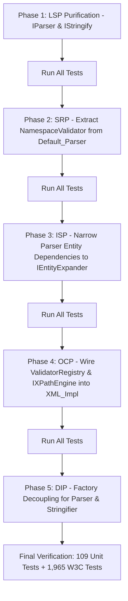

# XML_Lib Concrete SOLID Refactoring Plan

## 1. Executive Summary

This document presents an in-depth source analysis of `XML_Lib` against the **SOLID** object-oriented design principles and outlines a concrete, phase-by-phase refactoring plan to achieve complete SOLID compliance.

While `XML_Lib` features clean modularity, several subsystems exhibit architectural coupling:
- **God-classes / Multi-responsibility**: `Default_Parser` mixes lexical parsing with in-flight namespace validation and entity recursion limits; `XML_Impl` coordinates DOM storage while hard-coding concrete XSD and XPath implementations.
- **Leaky abstractions & dummy virtual methods (LSP violations)**: `IParser` contains stubbed `canValidate()` and empty `validate()` methods; `IStringify` contains dummy `getIndent()` / `setIndent()`.
- **Closed extension points (OCP violations)**: `ValidatorRegistry` exists as an abstraction but is not connected to `XML_Impl`, forcing hard-coded schema validations.
- **Fat interface dependencies (ISP violations)**: Multiple parsing routines depend on the composite `IEntityMapper` when only `IEntityExpander` is needed.
- **High-level modules depending on concretions (DIP violations)**: `XML_Impl` instantiates concrete `Default_Parser`, `Default_Stringify`, `XSD_Validator`, and `XPath` directly.

All refactoring phases will preserve backward compatibility, ensure zero runtime overhead, and maintain the **100% pass rate** across all 109 unit tests (1,622 assertions) and all 1,965 official W3C XML Conformance tests.

---

## 2. In-Depth SOLID Analysis & Target Areas

```
+--------------------------------------------------------------------------------------------------+
|                                    Current Architecture Gaps                                     |
+--------------------------------------------------------------------------------------------------+
|                                                                                                  |
|   1. Single Responsibility (SRP):                                                                |
|      Default_Parser ───► Token Parsing + In-Scope Namespace Validation + Entity Recursion Guard |
|      XML_Impl       ───► DOM Storage + DTD Dispatch + Hardcoded XSD + Hardcoded XPath            |
|                                                                                                  |
|   2. Open/Closed Principle (OCP):                                                                |
|      XML_Impl::validate(xsd) ───► Hardcoded XSD_Validator (closed to RelaxNG, Schematron, etc.)  |
|      XML_Impl::xpath(...)    ───► Hardcoded XPath engine (closed to alternative query engines)   |
|                                                                                                  |
|   3. Liskov Substitution (LSP):                                                                  |
|      IParser    ───► Defines dummy no-op validate(Node &) {} and canValidate() { return false; } |
|      IStringify ───► Defines dummy no-op setIndent(long) {}                                      |
|                                                                                                  |
|   4. Interface Segregation (ISP):                                                                |
|      parseAttributes / parseContent ───► Depend on fat IEntityMapper instead of IEntityExpander  |
|                                                                                                  |
|   5. Dependency Inversion (DIP):                                                                 |
|      XML_Impl ───► Directly constructs Default_Parser & Default_Stringify via make_unique        |
|                                                                                                  |
+--------------------------------------------------------------------------------------------------+
```

---

### Area 1: Single Responsibility Principle (SRP)

#### Current Violation
1. **`Default_Parser`**:
   - `Default_Parser` contains 734 lines responsible for:
     1. XML grammar tokenization (tags, declarations, comments, CDATA, PIs).
     2. Namespace validation (`validateElementNamespaces`, checking default namespace restrictions, reserved `xmlns` prefix checks, URI uniqueness).
     3. Entity expansion recursion control (`DepthGuard`, `entityExpansionDepth`, `maxEntityExpansionDepth`).
2. **`XML_Impl`**:
   - Manages DOM tree lifetime and memory arena.
   - Dispatches DTD validation.
   - Directly instantiates and configures `XSD_Validator`.
   - Directly instantiates and runs `XPath`.

#### Refactoring Target
1. **Extract `NamespaceValidator`**:
   - Create `classes/include/implementation/parser/NamespaceValidator.hpp` and `classes/source/implementation/parser/NamespaceValidator.cpp`.
   - Encapsulate `validateElement(const Element &element, const ISource &source, bool namespacesEnabled, bool strictNamespaces)` and in-scope namespace resolution.
2. **Extract `EntityRecursionLimiter`**:
   - Encapsulate `DepthGuard` and maximum recursion limits into a dedicated helper in `Default_Parser`.
3. **Decouple Query & Validation from `XML_Impl`**:
   - Move XSD validator and XPath orchestration to pluggable strategy delegates.

---

### Area 2: Open/Closed Principle (OCP)

#### Current Violation
- `XML_Impl::validate(const std::string_view &xsdSource)` directly calls:
  ```cpp
  XSD_Validator xsdValidator(root());
  BufferSource source(xsdSource);
  xsdValidator.parse(source);
  xsdValidator.validate(root());
  ```
- `XML_Impl::xpath(const std::string_view expression)` directly calls:
  ```cpp
  XPath xp(root());
  return xp.evaluate(expression);
  ```
- Any addition of new schema formats (e.g. RELAX NG, Schematron, JSON-Schema) or alternative query engines requires editing `XML_Impl.cpp`.
- Although `IValidatorRegistry` and `ValidatorRegistry` exist in `classes/include/implementation/ValidatorRegistry.hpp`, they are completely unused.

#### Refactoring Target
1. **Wire `IValidatorRegistry` into `XML_Impl`**:
   - Embed a `std::unique_ptr<IValidatorRegistry>` in `XML_Impl`.
   - Automatically register built-in validators (`"dtd"`, `"xsd"`).
   - Provide `registerValidator(schemaType, validator)` on `XML` and `XML_Impl`.
   - Implement `XML_Impl::validate(schemaType, schemaSource)` using the registry, with the existing `validate(xsdSource)` forwarding to `validate("xsd", xsdSource)` for full backward compatibility.
2. **Abstract XPath Query Engine (`IXPathEngine`)**:
   - Define `classes/include/interface/IXPathEngine.hpp`:
     ```cpp
     class IXPathEngine {
     public:
       virtual ~IXPathEngine() noexcept = default;
       virtual std::vector<const Node *> evaluate(const Node &contextNode, std::string_view expression) = 0;
     };
     ```
   - Make default `XPath` implement `IXPathEngine`.
   - Allow plugging custom query engines into `XML_Impl`.

---

### Area 3: Liskov Substitution Principle (LSP)

#### Current Violation
1. **`IParser` base interface**:
   - Lines 34-37 of `classes/include/interface/IParser.hpp`:
     ```cpp
     virtual bool canValidate() { return false; }
     virtual void validate([[maybe_unused]] Node &prolog) {}
     ```
   - An `IParser` implementation that cannot validate violates LSP by offering a `validate()` method that silently succeeds without validating.
2. **`IStringify` base interface**:
   - Lines 38-41 of `classes/include/interface/IStringify.hpp`:
     ```cpp
     [[nodiscard]] virtual long getIndent() const { return 0; }
     virtual void setIndent([[maybe_unused]] long indent) {}
     ```
   - Stateless stringifiers inherit a `setIndent` method that does nothing.

#### Refactoring Target
1. **Segregate `IParser` from `IValidatingParser`**:
   - `IParser` contract contains strictly `parse(ISource &, const ParseOptions &)`.
   - Validation capabilities belong strictly to `IValidatingParser` (or separate `ISchemaValidator`).
   - In `XML_Impl`, query `dynamic_cast<IValidatingParser*>(xmlParser.get())` or check `validatorRegistry` rather than relying on a base dummy method.
2. **Segregate `IStringify` from `IIndentedStringify`**:
   - `IStringify` contract contains strictly `stringify(const Node &, IDestination &, unsigned long)`.
   - Indentation configuration belongs exclusively in `IIndentedStringify`.

---

### Area 4: Interface Segregation Principle (ISP)

#### Current Violation
- `Default_Parser` passes `IEntityMapper &entityMapper` through:
  - `parseAttributes(ISource &source, IEntityMapper &entityMapper)`
  - `parseContent(ISource &source, Node &xNode, IEntityMapper &entityMapper, ...)`
  - `parseEntityReferenceXML(..., IEntityMapper &entityMapper, ...)`
  - `appendEntityOrContent(..., IEntityMapper &entityMapper, ...)`
- `parseAttributes` and `parseQuotedValue` only ever need entity string substitution (`IEntityExpander`). They do not need `ISecurityPolicyManager` or external catalog lookups.
- Clients are forced to depend on methods they do not call.

#### Refactoring Target
1. **Narrow Entity Interface Dependencies**:
   - `parseQuotedValue` and `appendTextSegment` in `XML_ParseHelpers` take `IEntityExpander *` instead of `IEntityMapper *`.
   - `parseAttributes` accepts `IEntityExpander &`.
   - Only routines performing catalog mutations or external entity resolution take `IEntityRegistry` or `IEntityMapper`.

---

### Area 5: Dependency Inversion Principle (DIP)

#### Current Violation
- `XML_Impl::XML_Impl(IStringify *stringify, IParser *parser)`:
  ```cpp
  if (parser == nullptr) {
    xmlParser = std::make_unique<Default_Parser>(*entityMapper);
  }
  if (stringify == nullptr) {
    xmlStringifier = std::make_unique<Default_Stringify>();
  }
  ```
  `XML_Impl` directly depends on the concrete classes `Default_Parser` and `Default_Stringify`.
- `Default_Parser::parseDTD`:
  ```cpp
  DTD_Validator dtdValidator(xDTD);
  dtdValidator.parse(source);
  ```
  `Default_Parser` directly instantiates concrete `DTD_Validator`.

#### Refactoring Target
1. **Introduce Component Factory Functions**:
   - Provide factory functions in `classes/include/interface/IParser.hpp` and `IStringify.hpp`:
     - `std::unique_ptr<IParser> createDefaultParser(IEntityMapper &entityMapper);`
     - `std::unique_ptr<IStringify> createDefaultStringify();`
   - High-level `XML_Impl` calls these factory entry points, decoupling `XML_Impl` from the internal layout and header dependencies of `Default_Parser` and `Default_Stringify`.
2. **Invert DTD Validator Creation in `Default_Parser`**:
   - Supply a validator factory callback or resolve DTD validation via `IValidatorRegistry`.

---

## 3. Phased Implementation Roadmap



### Phase 1: LSP Contract Purification
- Purify `IParser`: Remove no-op `canValidate()` and `validate(Node &)` from `IParser`. Keep them on `IValidatingParser`.
- Purify `IStringify`: Remove no-op `getIndent()` and `setIndent()` from `IStringify`. Keep them on `IIndentedStringify`.
- Update `XML_Impl.cpp` and `Mock_IParser.hpp`.
- **Verification**: `ninja -C build && ./build/tests/XML_Lib_Unit_Tests`

### Phase 2: SRP - NamespaceValidator Extraction
- Create `classes/include/implementation/parser/NamespaceValidator.hpp` and `classes/source/implementation/parser/NamespaceValidator.cpp`.
- Move `validateElementNamespaces` and QName namespace validation logic out of `Default_Parser.cpp` into `NamespaceValidator`.
- Update `CMakeLists.txt`.
- **Verification**: Run unit tests and W3C tests.

### Phase 3: ISP - Narrowing Entity Dependencies
- Change `parseQuotedValue` and `appendTextSegment` in `XML_ParseHelpers` to accept `IEntityExpander *` instead of `IEntityMapper *`.
- Narrow `parseAttributes` parameter to `IEntityExpander &`.
- `IEntityMapper` continues to implement `IEntityExpander`, ensuring 100% binary/source compatibility.
- **Verification**: Run unit tests and W3C tests.

### Phase 4: OCP - Pluggable Validator Registry & XPath Engine
- Connect `ValidatorRegistry` to `XML_Impl`.
- Register DTD and XSD validators in the registry by default.
- Expose `registerValidator(schemaType, validator)` on `XML` facade.
- Define `IXPathEngine` interface and make `XPath` implement it.
- **Verification**: Run XSD, DTD, and XPath test suites.

### Phase 5: DIP - Component Factory Decoupling
- Add factory functions `createDefaultParser` and `createDefaultStringify` declared in `interface/` headers and implemented in `source/`.
- Decouple `XML_Impl` constructor from direct instantiation of `Default_Parser` and `Default_Stringify`.
- **Verification**: Run full unit test suite and W3C conformance suite.

---

## 4. Verification Plan & Quality Gates

### Automated Testing Suite
For each phase:
1. **Core Unit Tests**:
   ```bash
   cmake --build build -j
   ./build/tests/XML_Lib_Unit_Tests
   ```
   *Requirement*: 109 test cases, 1,622 assertions, **0 failures**.

2. **Official W3C XML Conformance Test Suite**:
   ```bash
   ./build/tests/XML_Lib_Unit_Tests "Official W3C XML Conformance Test Suite"
   ```
   *Requirement*: All 1,965 tests evaluated, **100% pass rate, 0 failures**.

3. **CTest (Integration & Performance)**:
   ```bash
   ctest --test-dir build --output-on-failure
   ```
   *Requirement*: 2/2 tests passed (`XML_Lib_Unit_Tests`, `XML_Lib_Performance_Tests`).

---

## 5. Architectural Benefits Summary

| Principle | Before Refactoring | After Refactoring |
|---|---|---|
| **Single Responsibility (SRP)** | `Default_Parser` mixes tokenizing, namespace rules, and entity depth | `Default_Parser` tokenizes; `NamespaceValidator` enforces namespace rules |
| **Open/Closed (OCP)** | `XML_Impl` hardcodes DTD and XSD validation paths | `ValidatorRegistry` enables registering any schema validator without modifying core |
| **Liskov Substitution (LSP)** | `IParser` has no-op `validate()` method for non-validating parsers | `IParser` only parses; `IValidatingParser` validates |
| **Interface Segregation (ISP)** | `parseAttributes` takes fat `IEntityMapper` with security policies | Takes only `IEntityExpander &` needed for string expansion |
| **Dependency Inversion (DIP)** | `XML_Impl` depends directly on concrete `Default_Parser` / `Default_Stringify` | Depends on abstract interfaces via factory creation |
